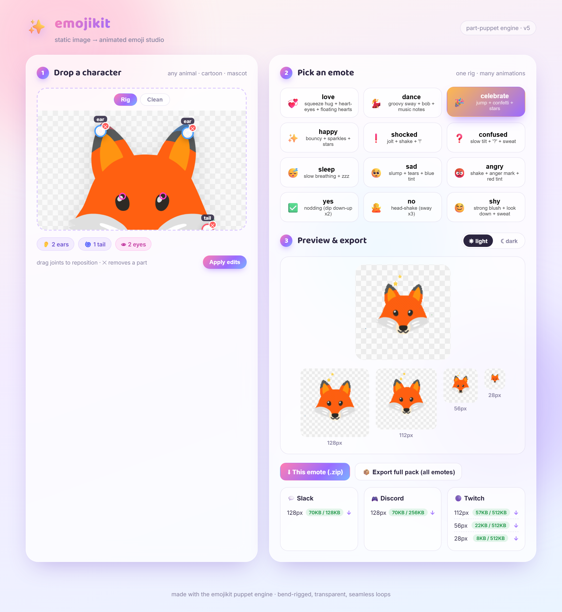

# emojikit

Turn any character image into a **high-quality animated emoji pack** (Slack / Discord / Twitch).

1. **Image → Emoji** — turn any picture into a small, clean, recognizable static emoji/sticker.
2. **Emoji → Animated emote** — a 2D **puppet engine** gives the character *real* motion
   (tail swish, body squeeze, blink, heart-eyes, floating hearts/stars/…) — not whole-image scaling.
   Fully automatic rigging works on **any animal / cartoon / mascot**, with a **web studio** to
   drag joints, pick from 12 emote presets, preview at every size, and export.



See [`DESIGN.md`](DESIGN.md) for the full architecture & research, and [`TODO.md`](TODO.md) for what's next.

## Setup

```powershell
python -m venv .venv
./.venv/Scripts/python.exe -m pip install -r requirements.txt
./.venv/Scripts/python.exe -m pip install rembg onnxruntime   # for Function 1 background removal
```

Requires **ffmpeg** on PATH (used for high-quality GIF palette encoding).
First Function 1 run downloads a ~176MB U²-Net model.

## Usage

### Emojify (Function 1)

```powershell
# local engine: background removal + contour stroke + multi-size export
./.venv/Scripts/python.exe -m emojikit emojify photo.jpg --focus top --stroke white

# generative (gpt-image-1, native transparent) — needs OPENAI_API_KEY
./.venv/Scripts/python.exe -m emojikit emojify photo.jpg --engine api --subject "a fluffy cat face" --style 3d

# generative via codex (gpt-image-2): prints a prompt, then finish the redraw locally
./.venv/Scripts/python.exe -m emojikit emojify photo.jpg --engine codex --subject "a fluffy cat face"
./.venv/Scripts/python.exe -m emojikit emojify photo.jpg --redraw redraw.png   # cuts bg + strokes + exports
```

Key options: `--focus none|top|center` (top = crop to head of portraits/animals),
`--stroke white|black|none`, `--stroke-width`, `--saturation`, `--contrast`, `--no-segment`.

### Web studio (recommended) 🎨

```powershell
./.venv/Scripts/python.exe -m emojikit serve      # -> http://127.0.0.1:8000
```

Drag a character → it auto-rigs (parts + pivots + eyes, visualized) → pick from 12 emote
presets → live preview at 28/56/112/128 on light/dark → download per platform.
See `docs/ui_landing.png` and `docs/ui_result.png`.

### Animated emotes — puppet engine (CLI)

Genuine part-based animation (tail swish, body squeeze, blink, heart-eyes, FX), not
whole-image transforms. Workflow: auto-rig (or SAM-segment) → rig JSON → animate with presets.

```powershell
# fully automatic (v4): auto-rig any animal/cartoon + animate, one command
./.venv/Scripts/python.exe -m emojikit auto path/to/character.png --preset love

# or step-by-step: build a rig (SAM point-prompts OR auto) then animate with presets
./.venv/Scripts/python.exe -m emojikit presets                                  # list emote presets
./.venv/Scripts/python.exe -m emojikit emote rigs/hugcats/rig.json --preset love
./.venv/Scripts/python.exe -m emojikit emote rigs/hugcats/rig.json --preset dance -p twitch
```

Presets: `love dance celebrate happy shocked confused sleep sad angry yes no shy`.
One rig → all of them. See `DESIGN.md §10.5`.

### Animate — quick whole-image effects (legacy)

```powershell
# list available effects
./.venv/Scripts/python.exe -m emojikit effects

# animate; outputs Slack/Discord/Twitch sizes + a high-quality WebP archive copy
./.venv/Scripts/python.exe -m emojikit animate assets/fox.png --effect "party+bounce"

# pick platform / tune motion
./.venv/Scripts/python.exe -m emojikit animate input.png -e shake -p twitch --fps 20 --frames 18
```

Effects combine with `+` (e.g. `party+bounce`, `spin+pulse`).

### Output layout

```
output/<name>/
  master.png          # 512px static, transparent
  master.webp         # 512px animated, TRUE alpha (archive copy)
  slack/<name>_128.gif
  discord/<name>_128.gif
  twitch/<name>_{112,56,28}.gif
```

Each GIF is auto-compressed under the platform byte budget (Slack <128KB, Discord <256KB,
Twitch <512KB/file). Any quality reduction is reported, never silent.

## Effects

`party` `rainbow` `shake` `spin` `pulse` `bounce` `wobble` `jello` `zoom` `slide` `glitch`
